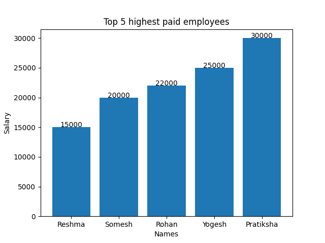

It is a simple GUI Project of Employee Managment System developed in **Python** and **Tkinter**.
Also **CRUD** operations are performed on data using _Sqlite3_.
And Some data visualization is done using **MATPLOTLIB**.
Images

## **`Main Window`**

## **`Add Emp Details Window`**

## **`View Emp Details Window`**

## **`Update Emp Details Window`**

## **`Delete Emp Detail Window`**

## **`Chart of Emp salary Window`**

## **`Bar Graph`**
